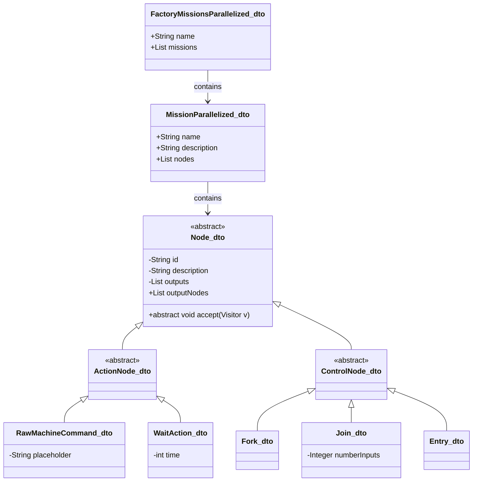

## Architecture Overview

The FactoryMissionsParallelized_dto structure is constructed by the FactoryScada from a corresponding configuration file.

Once built:

- The InitializerVisitor is invoked to initialize node attributes.
- The ExecuterVisitor then executes the missions described in the FactoryMissionsParallelized_dto.

## Data Structure: FactoryMissionsParallelized_dto

The following diagram illustrates the class hierarchy and composition of the parallelized mission execution model:

