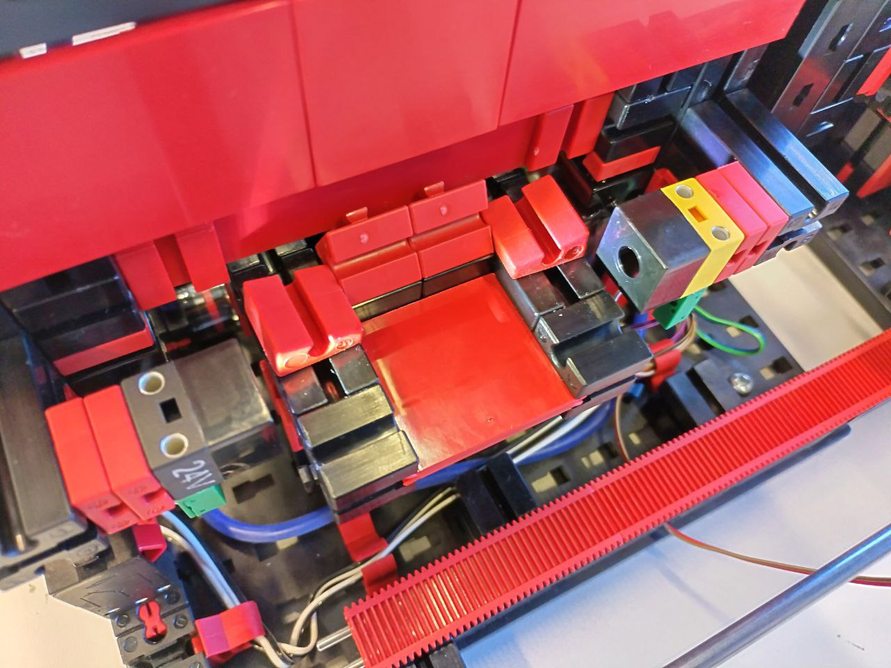
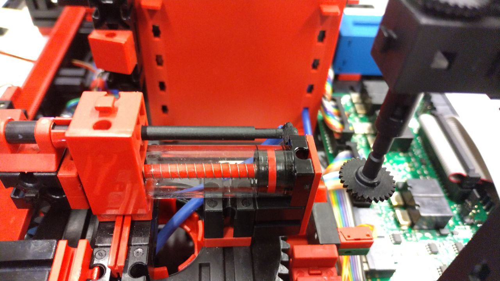
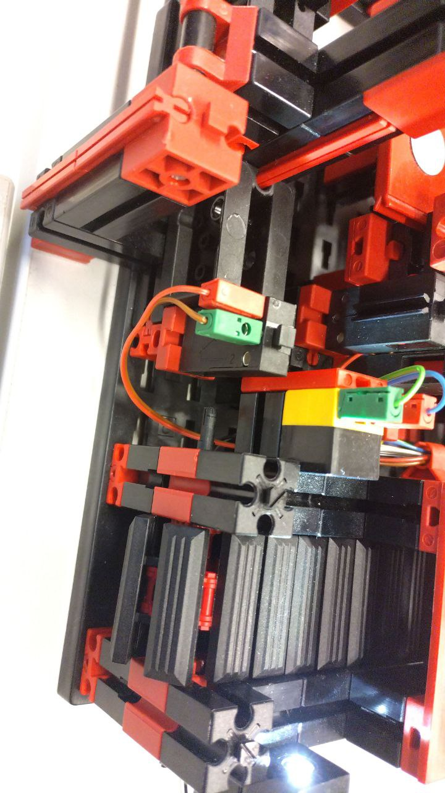

== Multi Processing Station hardware issues

=== Problem: turntable may not rotate correctly

The gears driving the turntable may not correctly touch together (red gear/black gear) (see <>)

.Turntable gears not touching correcly 
[#img-mps-turntable-gear-issue]
image::./img/MultiProcessingStation/MPS_turntable_gear_issue.jpg[float="left",align="center", 240]

**Fix:** Remove the gear and it's support.

.Removed gear
[#img-mps-removed-gear]
image::./img/MultiProcessingStation/MPS_remove_gear.jpg[float="left",align="center", 240]

Remove the red block on the side of the gear and place it between the two red parts as shown below. Remove or replace the attachment part as shown.

.Moved parts
[#img-mps-move-parts]
image::./img/MultiProcessingStation/MPS_move_part.jpg[float="left",align="center", 240]

Replace the gear. It should be much more stable.

.Replace gear
[#img-mps-gear-replaced]
image::./img/MultiProcessingStation/MPS_final_state.jpg[float="left",align="center", 240]

**Alternative Fix:** Fasten the engine over a currently disconnected and unused angle piece in the bottom, using spare
parts

The turn-table engine is movable, however it can be fastened in place with a currently unused angle piece which is
connected to the baseplate. In order to achieve this, spare parts or parts which are obtained later in this document
can be used.

.Turn-table engine now connected with the angle piece in the bottom
[#img-mps-fastened-tt-engine]
image::./img/MultiProcessingStation/MPS_fastened_tt_engine.jpg[float="left",align="center", 240]

=== Problem: light barrier at oven is positioned too high to detect payload

The lighbarrier at the oven is positioned a little too high to actually detect small payload objects

**Fix**: Move the support blocks below the lightbarrier (red) a little bit forward and then the light barrier als low as possible. 
.Moving the light barrier 
[#img-mps-light-barrier-adjustments]
image::./img/MultiProcessingStation/MPS_light_barrier_adjustments.jpg[float="left",align="center", 240]

Then remove the two front angled blocks on the sides of the feeder and move the two other angled blocks a bit back

.The new oven feeder platform
[#img-oven-feeder]

=== Problem: When dropping the payload at the turn table, it may not land correctly on the turn table

The vacuum arm and the turn table may not be perfectly positioned over another and the payload may fall off the table.

**Fix**: Take the two removed angled blocks from the light barrier problem above and put them on the sides of the turn table. 
Now it is necessary to remove the two red blocks on the sides of the conveyopr feeder for it to function correctly.

.The new belt feeder layout
[#img-mps-belt-feeder]
image::./img/MultiProcessingStation/MPS_belt_feeder_adjustments.jpg[float="left",align="center", 240]

=== Problem: Sometimes the spring of the feeder comes loose

It may happen, if there is a reasonable amount of stress on the turn-table feeder, that the upper spring comes lose and
shoots through the room.

**Fix:** Just keep the spring off. The internal spring should be strong enough to reset the feeder.

.The feeder without the upper spring
[#img-mps-feeder-without-spring]

=== Problem: Horizontal inaccuracies in the arm with the vacuum pump

Over time the pickup and placing of the token may show horizontal inaccuracies, which might lead to the payload token
falling off the turn-table.

**Fix:** The ref-switch at the turn-table is movable, in the same direction as the arm.
However, the connecting piece can be rotated by 90°, in order to remove that degree of freedom.

.The ref-switch at the turn-table now fixed in the direction of the arm
[#img-mps-fixed-ref-switch-at-tt]

The ref-switch at the oven is triggered through a movable plate mounted on the arm itself.
No solution has been found yet in order to fasten that plate, however it can easily be adjusted to offset occurring
inaccuracies.

.The movable plate on the arm, which hits the ref-switch at the oven
[#img-mps-arm-plate]
image::./img/MultiProcessingStation/MPS_movable_arm_ref_switch_plate.jpg[float="left",align="center", 240]